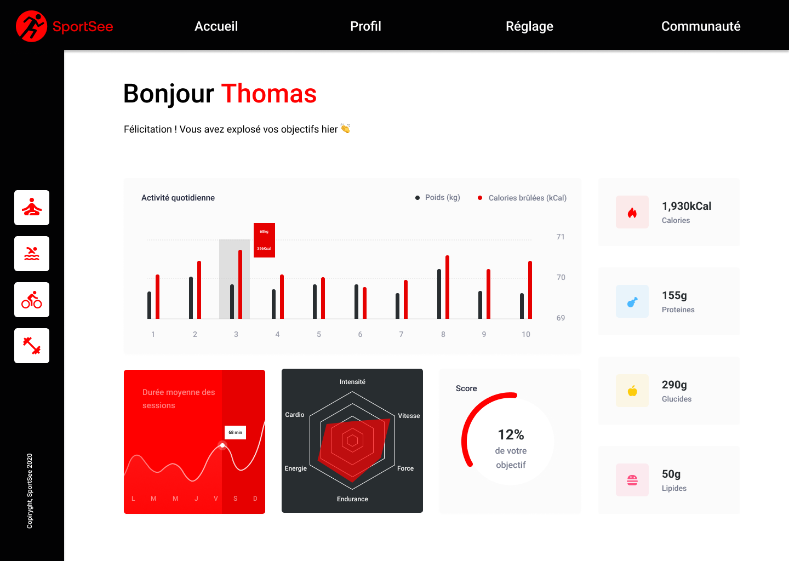

# SportSee : Analytics Dashboard

[Lire ce fihcier en français](#sportsee--tableau-de-bord-analytique)

## Description

SportSee, an innovative startup specializing in sports coaching, is launching a new version of the user profile page. This page will allow users to track their workout sessions and calories burned. The project aims to develop this page using React and ReCharts, providing a detailed view of workout statistics with data visualizations for the number of sessions completed and calories burned.

## Technologies Used

## Design

The application's design is primarily optimized for desktop screens, ensuring a clear and efficient user experience on large screens with a minimum resolution of 1024 x 780 pixels.

### Screenshots

Here is a screenshot illustrating the final result of the site:

## Installation

Follow these steps to install and run the SportSee project on your local machine for development and testing.

### Prerequisites

Make sure you have Node.js and npm installed on your machine. If not, you can download and install them from the [Node.js official website](https://nodejs.org/).

### Cloning the Repository

Open your terminal and run the following command to clone the GitHub repository:
`git clone https://github.com/IbrahimAlsabr/SportSee.git`

### Installing Backend Dependencies

Change the directory to the cloned project folder and install the necessary dependencies:

`cd SportSee/back-end`

`npm install`

### Starting the Backend

To start the backend, run the following command in the terminal: `npm start`. The backend will be launched on the port: `http://localhost:3000`.

### Installing Frontend Dependencies

Change the directory to the frontend folder and install the necessary dependencies:

`cd ../front-end`

`npm install`

### Starting the Frontend

To start the application, run the following command in the terminal: `npm run dev`.

Access the application via `http://localhost:5173`.

## Author

### Ibrahim Alsabr

  

---

---

---

---

 

# SportSee : Tableau de Bord Analytique

[Read this file in English](#sportsee--analytics-dashboard)

## Description

SportSee, une startup innovante spécialisée dans le coaching sportif, déploie une nouvelle version de la page de profil utilisateur. Cette page permettra aux utilisateurs de suivre leurs sessions d'entraînement et les calories brûlées. Le projet vise à développer cette page en utilisant React, et ReCharts offrant ainsi une vue détaillée des statistiques d'entraînement avec des visualisations de données pour le nombre de sessions effectuées et les calories consommées.

## Technologies Utilisées

## Design

Le design de l'application est principalement optimisé pour les écrans de bureau, garantissant une expérience utilisateur claire et efficace sur les grands écrans avec une résolution minimale de 1024 x 780 pixels

### Captures d'écran

Voici une capture d'écran qui illustre le résultat final du site :

## Installation

Suivez ces étapes pour installer et exécuter le projet SportSee sur votre machine locale pour le développement et les tests.

### Prérequis

Assurez-vous d'avoir Node.js et npm installés sur votre machine. Si ce n'est pas le cas, vous pouvez les télécharger et les installer depuis [Node.js official website](https://nodejs.org/).

### Clonage du dépôt

Ouvrez votre terminal et tapez la commande suivante pour cloner le dépôt GitHub :
`git clone https://github.com/IbrahimAlsabr/SportSee.git`

### Installation des dépendances de backend

Changez de répertoire pour accéder au dossier du projet cloné et installez les dépendances nécessaires :

`cd SportSee/back-end`

`npm install`

### Lancement de backend

Pour démarrer le backend, exécutez la commande suivante dans le terminal : `npm start` le back-end sera lancé sur le port: `http://localhost:3000`

### Installation des dépendances de frontend

Changez de répertoire pour accéder au dossier du projet cloné et installez les dépendances nécessaires :

`cd ../front-end`
`npm install`

### Lancement de frontend

Pour démarrer l'application, exécutez la commande suivante dans le terminal : `npm run dev`

Accédez à l'application via `http://localhost:5173`.

## Auteur

### Ibrahim Alsabr

  
